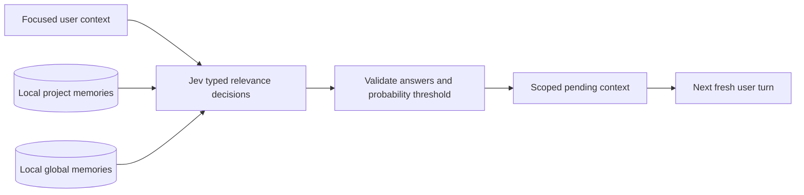

# Memory architecture

Updated: 2026-09-19

## Recall: Jev Decisions, not embeddings or a sidecar LLM

Jcode keeps persistent memories locally and sends bounded batches directly to
[Jev](https://docs.typesafe.ai/introduction) for typed relevance decisions. Jev
returns a probability for each candidate. It is neither a vector database nor a
text generator.



There is **no embedding model, BM25 candidate prefilter, generative reranker,
consensus sidecar, or old-pipeline fallback in recall**. Every active memory in
the requested project/global scope is eligible, regardless of age or whether it
has an embedding. Legacy embedding fields are preserved on disk but ignored.

Default builds no longer include the ONNX/tokenizer embedding stack. The
`embeddings` Cargo feature remains opt-in for historical benchmarks/debugging.
Startup warmup and automatic embedding backfill have been removed.

## Provider access

| Provider | Credential | Decisions endpoint |
|---|---|---|
| OpenRouter | `OPENROUTER_API_KEY` or `openrouter.env` | `https://openrouter.ai/api/alpha/decisions` |
| TypeSafe | `TYPESAFE_API_KEY` or `typesafe.env` | `https://api.typesafe.ai/v1/systemone` |
| AI/ML API | `AIMLAPI_API_KEY` or `aimlapi.env` | `https://api.aimlapi.com/v1/decisions` |
| Jcode subscription | Existing Jcode login | Trusted Jcode gateway `/v1/decisions` |

Environment files use the existing Jcode provider-config directory and
`KEY=value` format. OpenRouter can also be connected using `jcode login openrouter`.
No provider's credential is borrowed from a generic OpenAI-compatible key slot.

```toml
[agents]
memory_jev_provider = "auto"
memory_jev_threshold = 0.8

# Optional writing only. Recall does not use this model or setting.
memory_sidecar_enabled = false
```

`auto` chooses the first configured credential route in this order: Jcode,
OpenRouter, TypeSafe, then AI/ML API. Set `memory_jev_provider` (or
`JCODE_MEMORY_JEV_PROVIDER`) explicitly to choose the account to use. Neither
`auto` nor an explicit provider falls back to another account after an
entitlement, auth, billing, or network failure. This prevents a failed
subscription request from silently spending a BYOK balance. Thresholds must be
finite and in `0.8..=1.0`.

### Subscription boundary and rollout

The client checks live `GET /v1/me` for `capabilities.memory_jev == true` before
sending subscription Decisions requests. A cached tier or a credential's mere
presence does not prove entitlement. The companion gateway must enforce paid
subscription entitlement, upstream availability, request bounds, and per-account
rate limits on the Decisions endpoint itself.

The server route is an included subscription feature, not a client-side paywall
or a separate charge. **The companion gateway change must be deployed and its
upstream Jev credential configured before this route works.** Older gateways
without the capability fail closed. With a Jcode login configured, `auto` still
selects Jcode on an older gateway. To use BYOK in that situation, explicitly set
`memory_jev_provider` to `openrouter`, `typesafe`, or `aimlapi` (or use
`JCODE_MEMORY_JEV_PROVIDER`). There is no automatic fallback. BYOK does not depend
on the gateway rollout.

## Request and failure boundaries

- Each question is `noul`, asking whether a specific candidate directly helps
  with the current query. Question instructions explicitly name the candidate,
  because Jev question-map keys are not themselves inference instructions.
- Stored contents and conversation context are untrusted data in `state`, not
  instructions. Responses must contain exactly the requested answer IDs, the
  correct type, and finite probabilities between zero and one.
- Batches contain at most 24 memories and fit a 64 KiB encoded request budget.
  Calls are sequential, with a 60-second whole-selection deadline. Automatic
  context is UTF-8-safely bounded to 8 KiB. Oversize explicit queries are rejected.
- An individual memory that cannot fit the budget is skipped whole, not scored
  as a prefix and then injected with an unseen suffix. A content-free log records
  the number skipped.
- Accepted results are sorted by relevance. Automatic recall returns at most
  five memories and can return zero. It never pads the result set.
- Any failed batch invalidates the entire selection. There is no partial-result,
  stale-verdict, embedding, or conventional-LLM fallback.
- Requests have timeouts and bounded responses. Redirects are refused so bearer
  credentials cannot be redirected. Errors do not echo provider response bodies.

## Storage and lifetime

The existing graph JSON format remains compatible:

- `~/.jcode/memory/global.json`
- `~/.jcode/memory/projects/<working-directory-hash>.json`

Tags, relationships, categories, trust, sources, and superseded/inactive entries
are retained. Writes no longer create embeddings. Exact duplicate content within
the same category/scope reinforces the existing memory. Code spelling,
punctuation, and case are not collapsed for storage deduplication. Project writes
without a working directory fail rather than silently losing data.

The asynchronous coordinator receives one context update per fresh user turn.
Results are consumed on a later fresh user turn, not after every tool result.
Pending results expire after two minutes. Injection IDs are deduplicated per
session. Scope-bound consumption also checks that selected memories still exist,
are active, and have unchanged content, so switching projects or forgetting a
memory cannot inject the old queued payload.

Local `remember`, `list`, keyword `search`, recent recall, `forget`, tags, and
links remain available without paid access. Query-based `memory recall` and CLI
`memory search --semantic` use Jev. The old tool mode names `semantic` and
`cascade` are compatibility aliases for Jev, not vector/graph recall.

## Learning is separate from recall

Jev does not generate prose summaries. The main agent can still write concise
facts, preferences, entities, and corrections through the memory tool. Optional
periodic/session-end extraction may use the existing text-generating sidecar,
controlled by `memory_sidecar_enabled` and `memory_model`. It is not needed to
recall existing memories and can be disabled entirely. The old
`memory_rerank_*` and `memory_embedding_*` settings do not affect Jev recall.

## Privacy

Storage remains local, but Jev recall is remote inference: the focused query and
candidate memories in the selected scope are sent to the selected provider.
Scanning memories directly means more stored content may leave the machine than
with the old embedding shortlist. The subscription route forwards this content
through Jcode's gateway to its configured Jev upstream. Do not store secrets in
memory. Disabling the memory feature stops automatic recall. Local list/search
remain useful without making remote requests.

## Implementation map

- `crates/jcode-base/src/jev.rs`: provider-specific credentials and bounded HTTP.
- `crates/jcode-base/src/memory_jev.rs`: direct batched relevance selection.
- `crates/jcode-base/src/memory_agent.rs`: asynchronous per-session coordinator.
- `crates/jcode-base/src/memory.rs`: local storage and public compatibility APIs.
- `crates/jcode-base/src/memory/pending.rs`: scope-bound pending injection.
- `crates/jcode-app-core/src/tool/memory.rs`: public memory tool.

## Upstream references

- [TypeSafe introduction](https://docs.typesafe.ai/introduction)
- [TypeSafe HTTP API](https://docs.typesafe.ai/api)
- [OpenRouter Jev](https://openrouter.ai/~typesafe/jev-latest)
- [AI/ML API Jev](https://docs.aimlapi.com/api-references/decision-models/typesafe/jev)

Historical graph-cascade proposals in `docs/plans/MEMORY_GRAPH_PLAN.md` describe
the previous architecture, not the current recall path.
